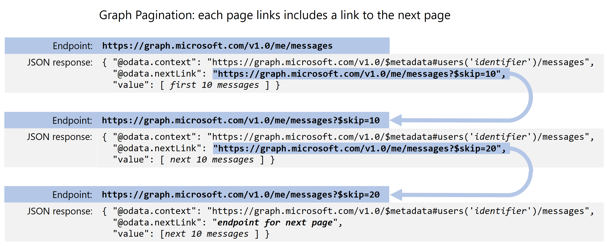
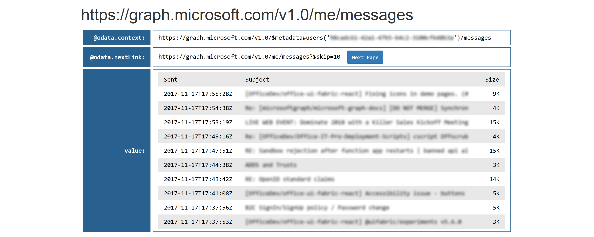
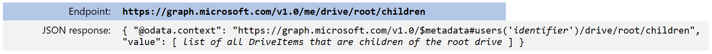
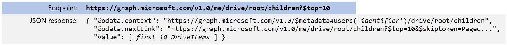
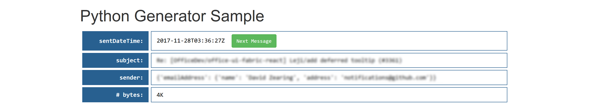
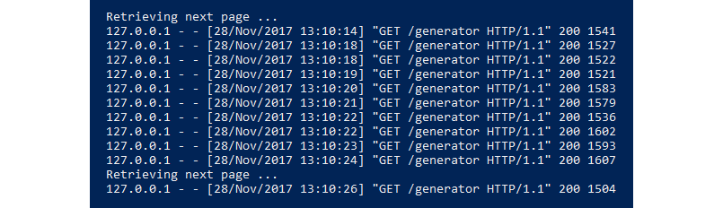

# Working with paginated Microsoft Graph responses in Python

Some Microsoft Graph queries can return a large number of entities, more than can be included in a single JSON payload. In those cases, Microsoft Graph _paginates_ responses to improve performance. This also makes the response more convenient and flexible for you.

This repo contains Python-based samples that show you how to work with paginated responses in Microsoft Graph. For a high-level overview of how pagination works, see [Paging Microsoft Graph data in your app](https://developer.microsoft.com/en-us/graph/docs/concepts/paging).

The samples in this repo use [messages](https://developer.microsoft.com/en-us/graph/docs/api-reference/v1.0/api/user_list_messages) to illustrate how pagination works, but the same concepts can be applied to any Microsoft Graph API that uses pagination, including messages, [contacts](https://developer.microsoft.com/en-us/graph/docs/api-reference/v1.0/api/user_list_contacts), [users](https://developer.microsoft.com/en-us/graph/docs/api-reference/v1.0/api/user_list), [groups](https://developer.microsoft.com/en-us/graph/docs/api-reference/v1.0/api/group_list), and others.

## In this article

* [Installation](#installation)
* [Basic concepts](#basic-concepts)
* [Using generators](#using-generators)
* [Contributing](#contributing)
* [Resources](#resources)

## Installation

Before installing the samples, verify that you have these prerequisites in place:

* Install Python from [https://www.python.org/](https://www.python.org/). We've tested the code with Python 3.6.2, but any Python 3.x version should work fine. If your code base is running under Python 2.7, you might find it helpful to use the [3to2](https://pypi.python.org/pypi/3to2) tools to port the code to Python 2.7.
* To register your application for access to Microsoft Graph, you'll need either a [Microsoft account](https://www.outlook.com) or an [Office 365 for business account](https://msdn.microsoft.com/en-us/office/office365/howto/setup-development-environment#bk_Office365Account). If you don't have one of these, you can create a Microsoft account for free at [outlook.com](https://www.outlook.com).

Follow these steps to install the sample code:

1. Clone this repo: ```git clone https://github.com/microsoftgraph/python-sample-pagination.git```.
2. Create and activate a virtual environment (optional). If you're new to Python virtual environments, [Miniconda](https://conda.io/miniconda.html) is a great place to start.
3. In the root folder of your cloned repo, install the dependencies for the sample as listed in [requirements.txt](https://github.com/microsoftgraph/python-sample-pagination/blob/master/requirements.txt) with this command: ```pip install -r requirements.txt```.

To complete the configuration of the samples, you'll need to register a new application in the Microsoft Application Registration Portal. You only need to do this once, and then any Microsoft identity can be used to run the samples.

Follow these steps to register a new application:

1. Sign in to the [Application Registration Portal](https://apps.dev.microsoft.com/) using either your personal or work or school account.

2. Under **My applications**, choose **Add an app**. If you're using an Office 365 account and see two categories listed (Converged or Azure AD only), choose **Add an app** for the Converged applications section.

3. Enter an application name, and choose **Create**. (Do *not* choose **Guided Setup**.)

4. Next you'll see the registration page for your app. Copy and save the **Application Id** field. You'll need it later to complete the configuration process.

5. Under **Application Secrets**, choose **Generate New Password**. A new password will be displayed in the **New password generated** dialog. Copy this password. You'll need it later to complete the configuration process.

6. Under **Platforms**, choose **Add platform** > **Web**.

7. Under **Delegated Permissions**, add the **Mail.Read** permission.

8. Enter `http://localhost:5000/login/authorized` as the Redirect URL, and then choose **Save**.

As the final step in configuring the sample, modify the [config.py](https://github.com/microsoftgraph/python-sample-pagination/blob/master/config.py) file in the root folder of your cloned repo, and follow the instructions to enter your Client ID and Client Secret (which are referred to as Application ID and Password in the app registration portal). Save the change, and you're ready to run the samples.

## Basic concepts

Pagination for potentially large result sets in Microsoft Graph is based on the [odata.context](http://docs.oasis-open.org/odata/odata-json-format/v4.0/cs01/odata-json-format-v4.0-cs01.html#_Toc365464685) and [odata.nextLink](http://docs.oasis-open.org/odata/odata-json-format/v4.0/cs01/odata-json-format-v4.0-cs01.html#_Toc365464689) annotations that are defined in [OData JSON Format Version 4.0](http://docs.oasis-open.org/odata/odata-json-format/v4.0/cs01/odata-json-format-v4.0-cs01.html).

When you query a paginated Microsoft Graph API (for example, ```me/messages```), you'll get back a JSON payload that contains these top-level elements:

* ```@odata.context``` - Contains a URI that identifies the type of data being returned. This value is the same for every page of the result set.
* ```@odata.nextLink``` - Contains a link to the next page of results. You can do a GET against that endpoint to return the next page, which will contain a link to the next page after that, and you can repeat this process until the final page, which will not have this element.
* ```value``` - Contains the returned data, as a list of JSON elements. In the ```me/messages``` example, this would be a list of email messages. The number of items returned is based on the page size. Each paginated API has a default page size (for example, the ```me/messages``` default is 10 messages), and you can specify a different page size by using the ```$top``` parameter. Note that the default page size and maximum page size might vary for different Microsoft Graph APIs &mdash; see [Paging Microsoft Graph data in your app](https://developer.microsoft.com/en-us/graph/docs/concepts/paging) for more information.

The following diagram shows how this works in practice, using the ```me/messages``` endpoint as an example.



The [pagination.py](https://github.com/microsoftgraph/python-sample-pagination/blob/master/pagination.py) sample in this repo provides an interactive demonstration of how it works. Follow the [Installation](#installation) instructions to install the sample, and then do the following to run it:

1. At the command prompt: ```python pagination.py```
2. In your browser, go to [http://localhost:5000](http://localhost:5000).
3. Choose **Connect** and authenticate with a Microsoft identity (work or school account or Microsoft account).

You'll then see the following page listing your most recent 10 messages:



The ```@odata.nextLink``` value links to the next page of results. Each time you choose the **Next Page** button, the next page of results is loaded. This is the fundamental behavior of paginated responses from Microsoft Graph APIs.

### What if @odata.nextLink is missing?

In some cases, Graph APIs return all of the requested entities in a single response, and in that case the `@odata.nextLink` element is missing from the response. This may also occur when you have received the last page of data. The absence of this property tells you that there are no more pages of data available in the collection.

For example, if there are fewer than 250 items in your OneDrive root folder, you will see this JSON response when you request all the [DriveItems](https://developer.microsoft.com/en-us/graph/docs/api-reference/v1.0/resources/driveitem) in the folder by doing a GET to the ```https://graph.microsoft.com/v1.0/me/drive/root/children``` endpoint:



Because there is no ```@odata.nextLink``` element, you know that this is a complete result set that contains all the requested DriveItems. The default page size for this API is 250 items, so they all fit within a single page of results.

But the same API can return paginated responses, if the result set is larger than the page size. For example, here we're using the ```$top``` query string parameter to return only the first 10 items from the same set:



In this case, the first 10 DriveItems are returned, and you can use an ```@odata.nextLink``` value to query the next page of 10 items.

When working with collections in Graph APIs, your code must always check for `@odata.nextLink` to determine whether there are additional pages of data available, and understand that if the property is missing the result is the last page of available data. There is an example of this in the generator sample below.

## Using generators

The Microsoft Graph API returns _pages_ of results, as demonstrated in [pagination.py](https://github.com/microsoftgraph/python-sample-pagination/blob/master/pagination.py). But in your application or service, you might want to work with a single non-paginated collection of _items_ such as messages, users, or files. This sample creates a Python [generator](https://wiki.python.org/moin/Generators) that hides the pagination details so that your application code can simply ask for a collection of messages and then iterate through them using standard Python idioms such as ```for messages in messages``` or ```next(message)```.

The [generator.py](https://github.com/microsoftgraph/python-sample-pagination/blob/master/generator.py) sample in this repo provides an interactive demonstration of how it works. Follow the [Installation](#installation) instructions to install the sample, and then do the following to run it:

1. At the command prompt: ```python generator.py```
2. In your browser, go to [http://localhost:5000](http://localhost:5000).
3. Choose **Connect** and authenticate with a Microsoft identity (work or school account or Microsoft account).

You'll then see the most recent message you've received:



Each time you choose **Next Message**, you'll see the next message. The ```generator()``` function in [generator.py](https://github.com/microsoftgraph/python-sample-pagination/blob/master/generator.py) handles the details of retrieving pages of results and then returning (_yielding_) the messages
one at a time.

```python
def graph_generator(session, endpoint=None):
    """Generator for paginated result sets returned by Microsoft Graph.
    session = authenticated Graph session object
    endpoint = the Graph endpoint (for example, 'me/messages' for messages,
               or 'me/drive/root/children' for OneDrive drive items)
    """
    while endpoint:
        print('Retrieving next page ...')
        response = session.get(endpoint).json()
        yield from response.get('value')
        endpoint = response.get('@odata.nextLink')
```

The key concept to understand in this code is the ```yield from``` statement, which returns values from the specified iterator &mdash; ```response.get('value')``` in this case &mdash; until it is exhausted.

To create a generator at runtime, pass the Microsoft Graph session connection object and the API endpoint for retrieving messages:

```python
MSG_GENERATOR = messages(MSGRAPH, 'me/messages')
```

The calling code uses Python's built-in ```next()``` function to retrieve messages:

```python
def generator():
    """Example of using a Python generator to return items from paginated data."""
    return {'graphdata': next(MSG_GENERATOR)}
```

Call ```next(MSG_GENERATOR)``` whenever you need the next message, and you don't need to be aware of the fact that paginated results are coming from Microsoft Graph. You might notice a slightly longer response time whenever a new page is retrieved (every 10th message, with the default page size of 10 messages in the sample), but the individual items within each page are returned immediately without any need to call Microsoft Graph, because they're in the page of results that is being retained in the state of the generator function after each ```yield``` statement.

Here's an example of the console output that you'll see if you click the **Next Message** button 10 or more times while running the generator sample:



Python generators are recommended for working with all paginated results from Microsoft Graph. You can use the ```generator``` function in this sample for messages, users, groups, drive items, and other paginated responses from Microsoft Graph APIs.

## Contributing

These samples are open source, released under the [MIT License](https://github.com/microsoftgraph/python-sample-pagination/blob/master/LICENSE). Issues (including feature requests and/or questions about this sample) and [pull requests](https://github.com/microsoftgraph/python-sample-pagination/pulls) are welcome. If there's another Python sample you'd like to see for Microsoft Graph, we're interested in that feedback as well &mdash; please log an [issue](https://github.com/microsoftgraph/python-sample-pagination/issues) and let us know!

This project has adopted the [Microsoft Open Source Code of Conduct](https://opensource.microsoft.com/codeofconduct/). For more information, see the [Code of Conduct FAQ](https://opensource.microsoft.com/codeofconduct/faq/) or contact [opencode@microsoft.com](mailto:opencode@microsoft.com) with any additional questions or comments.

## Resources

* [Paging Microsoft Graph data in your app](https://developer.microsoft.com/en-us/graph/docs/concepts/paging)
* [OData JSON Format Version 4.0](http://docs.oasis-open.org/odata/odata-json-format/v4.0/cs01/odata-json-format-v4.0-cs01.html)
* [Python Wiki: Generators](https://wiki.python.org/moin/Generators)
* [Python authentication samples for Microsoft Graph](https://github.com/microsoftgraph/python-sample-auth)
