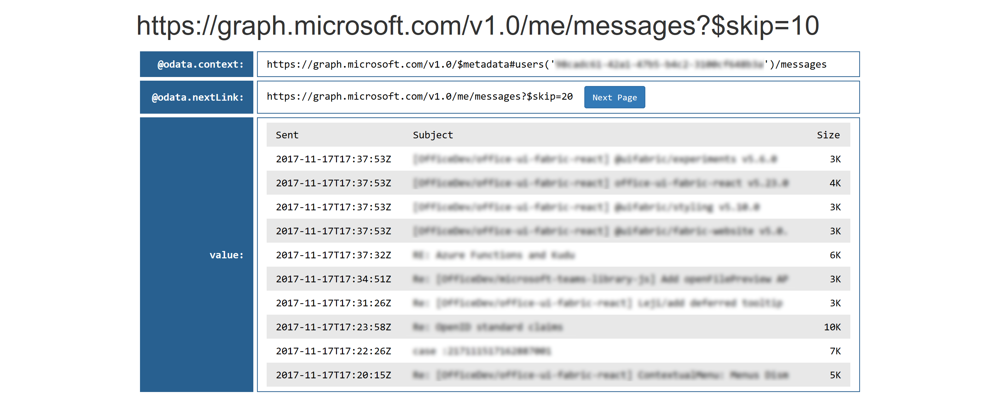

# Working with paginated Graph responses in Python

Some Microsoft Graph queries can return a large number of entities, more than can practically be included in a single JSON payload. In those cases, Graph _paginates_ responses to improve performance as well as developer convenience and flexibility.

This repo contains Python-based examples of how to work with Graph's paginated responses. For a high-level overview of how pagination works in Microsoft Graph, see [Paging Microsoft Graph data in your app](https://developer.microsoft.com/en-us/graph/docs/concepts/paging).

The samples in this repo use **messages** to illustrate how pagination works, but the same concepts can be applied to any Graph API that uses pagination, including [messages](https://developer.microsoft.com/en-us/graph/docs/api-reference/v1.0/api/user_list_messages), [contacts](https://developer.microsoft.com/en-us/graph/docs/api-reference/v1.0/api/user_list_contacts), [users](https://developer.microsoft.com/en-us/graph/docs/api-reference/v1.0/api/user_list), [groups](https://developer.microsoft.com/en-us/graph/docs/api-reference/v1.0/api/group_list), and others.

* [Installation](#installation)
* [Running the samples](#running-the-samples)
* [Basic concepts](#basic-concepts)
* [Using generators](#using-generators)
* [Contributing](#contributing)
* [Resources](#resources)

## Installation

/// how to install the samples and run them

## Running the samples

/// how to launch the samples
/// note these use graphrest for auth; link to the auth repo for auth options

## Basic concepts

Graph's approach to pagination for potentially large result sets uses the [odata.context](http://docs.oasis-open.org/odata/odata-json-format/v4.0/cs01/odata-json-format-v4.0-cs01.html#_Toc365464685) and [odata.nextLink](http://docs.oasis-open.org/odata/odata-json-format/v4.0/cs01/odata-json-format-v4.0-cs01.html#_Toc365464689) annotations that are defined in [OData JSON Format Version 4.0](docs.oasis-open.org/odata/odata-json-format/v4.0/cs01/odata-json-format-v4.0-cs01.html).

When you query a paginated Graph API (for example, ```me/messages```), you'll get back a JSON payload that contains these top-level elements:

* ```@odata.context``` contains a URI that identifies the type of data being returned. This value is the same for every page of the result set.
* ```@odata.nextLink``` contains a link to the next page of results. You can do a GET against that endpoint to return the next page, which will contain a link to the next page after that, and you can repeat this process until the final page, which will not have this element.
* ```value``` contains the returned data, as a list of JSON elements. In the ```me/messages``` example, this would be a list of email messages. The number of items returned is based on the page size. Each paginated API has a default page size (for example, the ```me/messages``` default is 10 messages), and you can specify a different page size if desired through use of the ```$top``` parameter. Note that the default page size and maximum page size may vary for different Graph APIs &mdash; see [Paging Microsoft Graph data in your app](https://developer.microsoft.com/en-us/graph/docs/concepts/paging) for more information.

The following diagram shows how this works in practice, using the ```me/messages``` endpoint as an example. The message data has been omitted for clarity.


The [pagination.py](https://github.com/microsoftgraph/python-sample-pagination/blob/master/pagination.py) sample in this repo provides an interactive demonstration of how it works. After you install and run the sample, authenticate under your identity and you'll see the following page listing your most recent 10 messages:


The **@odata.nextLink** value links to the next page of results. Choose **Next Page** to load the next page of paginated results, and you'll see this:



Each time you click on the **Next Page**, the next page of results is loaded. This is the fundamental behavior of paginated responses from Graph APIs. In the next section, [Using generators](#using-generators), we'll look at how to implement a Python generator function to hide these details and work with the result set as if it were a standard Python iterable.

### What if @odata.nextLink is missing?

Some Graph APIs return all of the requested entities by default, and in that case the ```@odata.nextLink``` element is not provided. The absense of this element tells you that the ```value``` element contains all entities in a single page.

For example, if there are less than 250 items in your OneDrive root folder, you will see this JSON response when you request all of the [DriveItems](https://developer.microsoft.com/en-us/graph/docs/api-reference/v1.0/resources/driveitem) in the folder by doing a GET to the ```https://graph.microsoft.com/v1.0/me/drive/root/children``` endpoint:


Since there is no ```@odata.nextLink``` element, you know that this is a complete result set that contains all of the requested DriveItems. The default page size for this API is 250 items, so they all fit within a single page of results.

But the same API can also return paginated responses, if the result set is parger than the page size. For example, here we're using the ```$top``` query string parameter to return only the first 10 items from the same set:


In this case, we've received the first 10 DriveItems, and there is an ```@odata.nextLink``` value which we can use to query the next page of 10 items.

As a best practice, your code should allow for the fact that ```@odata.nextLink``` may be missing, in which case there is no pagination to be handled. There is an example of this in the generator sample below.

## Using generators

/// how to implement a generator for paginated responses, show generators.py sample

/// in the pagination sample, we looked at the aggregation of all messages for the current user; in this sample, we're adding the concept of a mailfolder, so that you can step through messages in a particular folder if desired

## Contributing

These samples are open source, released under the [MIT License](https://github.com/microsoftgraph/python-sample-pagination/blob/master/LICENSE). Issues (including feature requests and/or questions about this sample) and [pull requests](https://github.com/microsoftgraph/python-sample-pagination/pulls) are welcome. If there's another Python sample you'd like to see for Microsoft Graph, we're interested in that feedback as well &mdash; please log an [issue](https://github.com/microsoftgraph/python-sample-pagination/issues) and let us know!

This project has adopted the [Microsoft Open Source Code of Conduct](https://opensource.microsoft.com/codeofconduct/). For more information, see the [Code of Conduct FAQ](https://opensource.microsoft.com/codeofconduct/faq/) or contact [opencode@microsoft.com](mailto:opencode@microsoft.com) with any additional questions or comments.

## Resources

* [Paging Microsoft Graph data in your app](https://developer.microsoft.com/en-us/graph/docs/concepts/paging)
* [OData JSON Format Version 4.0](http://docs.oasis-open.org/odata/odata-json-format/v4.0/cs01/odata-json-format-v4.0-cs01.html)
* [Python Wiki: Generators](https://wiki.python.org/moin/Generators)
* [Python authentication samples for Microsoft Graph](https://github.com/microsoftgraph/python-sample-auth)
